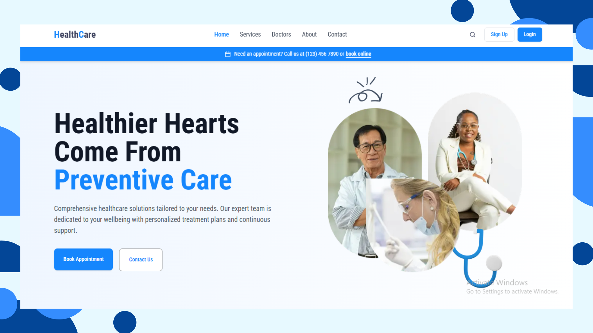

# 🏥 Health Care Platform

An **Healthcare management web application** that connects **Admins, Doctors, and Patients** in a seamless ecosystem. Patients can **book appointments**, consult doctors via **video calls**, and receive **digital prescriptions**, while doctors manage schedules and admins oversee the entire system.

Built with **Next.js, TypeScript, Prisma, PostgreSQL, Node.js, and Express.js**, the platform ensures **security, scalability, and real-time updates**.

---

## 📸 Screenshot



---

## ✨ Features

- ✅ **Role-Based Access Control (RBAC)** – Separate dashboards and permissions for Admin, Doctor, and Patient.
- ✅ **Doctor Scheduling System** – Real-time availability with appointment bookings.
- ✅ **Video Consultations** – Integrated video call system for remote checkups.
- ✅ **Digital Prescriptions** – Doctors can create and share prescriptions online.
- ✅ **Secure Payments** – Appointment-to-payment workflow for patients.
- ✅ **Modern & Responsive UI** – Clean, mobile-friendly design with Tailwind CSS and Framer Motion.

---

## 🚀 Tech Stack

- **Frontend:** Next.js + TypeScript
- **Styling:** Tailwind CSS, shadcn/ui, Framer Motion
- **State Management:** React Redux, React Hooks
- **Video Calls:** ZegoCloud UIKit
- **Backend:** Node.js + Express.js + Prisma + PostgreSQL
- **Auth & Validation:** JWT, Zod, Clerk (if integrated)
- **Others:** Recharts for analytics, Cloudinary for media storage

---

## 📦 Installation & Setup

### 1. Clone the Repository

```bash
git clone https://github.com/abdullahal5/healthcare-client.git
cd healthcare-client
npm install
# or
yarn install
```

---

## 🔑 Environment Variables

Create a `.env` file in the root of the project and add the following variables (use your own secure values instead of these demo placeholders):

```env
NEXT_PUBLIC_BACKEND_API_URL=https://healthcare-server-pi.vercel.app/api/v1
```

---

## 🌐 Backend
- Server Repo: [Link](https://github.com/abdullahal5/healthcare-server)
- Live API: healthcare-server-pi.vercel.app
